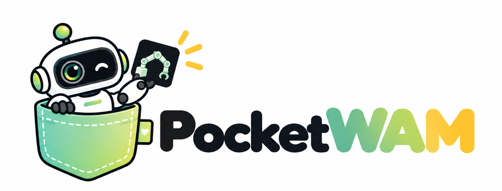
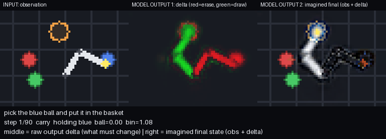
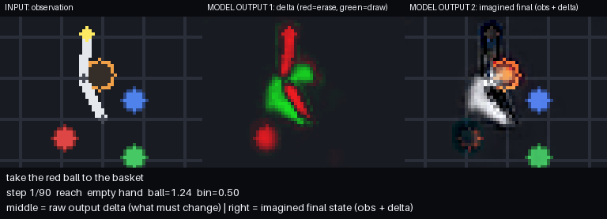
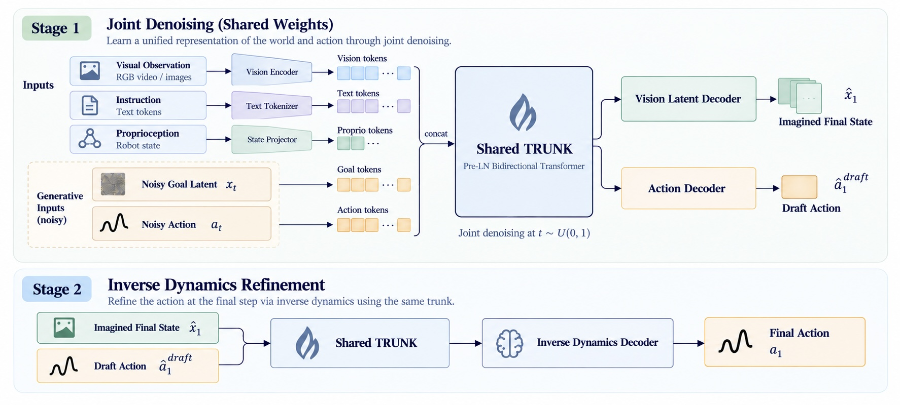

<p align="center">
  
</p>
<p align="center"><h1 align="center">PocketWAM: Building a 0.003B World Action Model from Absolute Zero</h1></p>
<p align="center"><a href="../README.md">简体中文</a> | English</p>

<p align="center">
  
  
  
  
</p>

## Introduction

🚀 **Following the open-sourcing of [PocketVLA](https://github.com/penpenzh/pocketvla)** (if you are unfamiliar with this project's subtask, we recommend reading [PocketVLA](https://github.com/penpenzh/pocketvla) first), **we now open-source PocketWAM**: once again **entirely from scratch** (an extremely lightweight simulation environment, data generation, the model, two-stage training, closed-loop evaluation, and interactive demo — all implemented from zero), we build a **WAM (World Action Model)** with only **0.003B** parameters, fully realizing the paradigm of **jointly generating future world states and actions**, and validating end-to-end its effectiveness on closed-loop control tasks: on the same subtask, PocketWAM achieves a **100%** closed-loop success rate with **pure SFT**, surpassing the SFT version of PocketVLA trained on low-data demonstrations (74.2%), as well as its version further improved with GRPO reinforcement learning (80.2%).

🧠 **The core difference between WAM and VLA**: a VLA only learns "state → action"; a WAM **jointly generates "future world state + current action"**, using the imagined final-state image as an implicit visual planner to guide action generation:

```
π(o_goal, a | o_t, c, q_t)  =  π(o_goal | o_t, c)        ·  π(a | o_t, o_goal, q_t)
                                └─ video prediction (world model)   └─ inverse dynamics (action)
```

🦾 On a 2-link robot arm "language-guided pick-and-place" task, the model **outputs only two things per step**: the **imagined final-state image** (a 64×64 "dream": the instructed ball already in the bin) + the **current action** `(Δq1, Δq2, grip)`, with no auxiliary heads; inference is two-pass — Pass A jointly denoises the "dream + action draft", and Pass B at t=1 takes the imagined image and **explicitly decodes** the action (⚡ Flash single-step mode `denoise_steps: 1`, only 2 forward passes per step). 🎬 Real closed-loop replays 👇

<p align="center">
  
  
</p>
<p align="center"><sub>Real observation | Δ change map | Imagined final state</sub></p>

📌 This project **continues to use exactly the same [2D-Grab task](https://github.com/penpenzh/pocketvla#%E4%B8%8B%E6%B8%B8%E4%BB%BB%E5%8A%A1-2d-grab) as PocketVLA**: the simulation, the evaluation protocol, and all test data (fixed test set of 500 scenes, OOD set of 300 scenes); 🎯 the goal is to **help readers quickly get started with the WAM paradigm through a lighter, more readable implementation**.

**🎉This project includes the following**:

- 🧪 **Ultra-lightweight simulation environment** (`pwam/sim/`, line-by-line identical to PocketVLA): a 2-link planar arm performing top-down 2D "pick-and-place" + 64×64 observation rendering (no target annotation, no observation leakage) + GIF replay.
- 🌍 **WAM model implemented from scratch** (`pwam/model/wam.py`): every single module is built from zero.
- 🎯 **WAM-paradigm data pipeline** (`pwam/data/collect.py`): extensible — define new tasks and more.
- 📚 **Two-stage training** (`pwam/train.py`): Stage-0: video-only world-model pretraining; Stage-1: SFT initialized from the pretrained backbone, fitting the joint "video (imagined final state) + two-pass action" loss; class-balanced gripper loss.
- 📊 **Closed-loop evaluation** (`pwam/evaluate.py`): exactly the same protocol and metrics as PocketVLA (closed-loop success rate / correct-grab rate / drop distance / failure attribution / per-color statistics / expert-trajectory comparison), plus WAM-specific **world-model metrics** (PSNR, etc.).
- 🌗 **OOD generalization evaluation** (`pwam/eval_ood.py`): a 300-scenario pure-OOD protocol — zero distractor exposure during training, with 8 unseen-color ball/cube distractors added at test time.

## Download

**Model weights**

| Model | Parameters | Stage | Closed-loop success rate | Download |
|---|---|---|---|---|
| pocketwam-3m-pt-2d-grab | 3.23M | Stage-0 pretraining | — (video-only, action head untrained) | 🤗 [HuggingFace](https://huggingface.co/penpenzh/pocketwam-3m-pt-2d-grab) |
| pocketwam-3m-pt-sft-2d-grab | 3.23M | Pretraining + SFT | **100.0%** | 🤗 [HuggingFace](https://huggingface.co/penpenzh/pocketwam-3m-pt-sft-2d-grab) |

**Data**

| File | Scale | Download |
|---|---|---|
| test.npz | 500 scenes | 🤗 [HuggingFace](https://huggingface.co/datasets/penpenzh/pocketvla-dataset-2D-grab/blob/main/test.npz) |
| ood_test.npz | 300 scenes | 🤗 [HuggingFace](https://huggingface.co/datasets/penpenzh/pocketvla-dataset-2D-grab/blob/main/ood_test.npz) |
| train.npz | ~14,000 episodes / ~359K samples | generated by script |
| val.npz | ~6,000 episodes / ~154K samples | generated by script |
| pretrain_synth.npz | 90,000 pairs | generated by script |
| pretrain_play.npz | ≈156,000 pairs | generated by script |

```bash
# Evaluation sets: download into dataset/ (evaluate / eval_ood read dataset/test.npz and dataset/ood_test.npz by default)
huggingface-cli download penpenzh/pocketvla-dataset-2D-grab \
    test.npz ood_test.npz --repo-type dataset --local-dir dataset

# Training set: not provided for download — fixed seed, one command reproduces everything
python3 -m pwam collect
```

## Quick Start

```bash
# Environment setup
conda create -n pocketwam python=3.10 -y
conda activate pocketwam
pip install -r requirements.txt
```

```bash
# Run the full pipeline (collect -> pretrain -> train -> evaluate -> OOD eval)
bash scripts/run_all.sh
```

Or run step by step:

```bash
# 0. Dataset generation: SFT demos (with WAM expansion + final-state targets)
#    + Stage-0 pretrain set (synthetic goals + play dynamics)
#    + test/ood_test scenario sets (identical to PocketVLA) in one shot
python3 -m pwam collect

# 1. Stage 0: world-model pretraining (video-only) -> outputs_pretrain_wam_3m/
python3 -m pwam pretrain --config configs/sft_wam_3m.yaml

# 2. Stage 1: SFT, initialized from the pretrained backbone -> outputs_sft_wam_3m/train/
python3 -m pwam train --config configs/sft_wam_3m.yaml

# 2. Closed-loop eval on the fixed 500-scenario test set
#    (GIFs + failure attribution + figures + world-model PSNR) -> outputs_sft_wam_3m/eval/
python3 -m pwam evaluate --config configs/sft_wam_3m.yaml

# 3. OOD generalization eval (unseen-color distractor, 300 scenarios)
python3 -m pwam.eval_ood --config configs/sft_wam_3m.yaml

```

## Quick Inference Example

```python
import pwam.model   # register PocketWAM with AutoModel/AutoTokenizer (run from repo root)
import torch
from transformers import AutoModel, AutoTokenizer

ckpt = "outputs_sft_wam_3m/train/pocketwam-3m"   # or point to the HF download dir: penpenzh/pocketwam-pt-sft-2d-grab
model = AutoModel.from_pretrained(ckpt, trust_remote_code=True).eval()
tok = AutoTokenizer.from_pretrained(ckpt, trust_remote_code=True)

image = torch.rand(1, 3, 64, 64)                    # top-down view in [0, 1]
enc = tok("put the green ball into the bin", padding="max_length",
          truncation=True, max_length=model.config.lang_len)
tokens = torch.tensor([enc["input_ids"]])
pad = tokens != 0
proprio = torch.tensor([[0.5, -0.3, 0.2, 0.4, 0.0, 0.0]])
# (q1/pi, q2/pi, ee_x/1.1, ee_y/1.1, gripper, holding)

with torch.no_grad():
    goal, action = model.generate(image, tokens, pad, proprio, steps=1)

print("imagined final state:", goal.shape)          # (1, 3, 64, 64) in [-1, 1]
print("action (dq1, dq2, grip):", action[0].tolist())
# Hand the action to the simulation environment for closed-loop execution: obs, _, done, info = env.step(
#     [action[0,0]*0.15, action[0,1]*0.15, action[0,2]])
```

## PocketWAM Model Architecture

<p align="center"></p>

**Overview**: **0.003B (3.23M)** parameters. Input = `(observation 64×64×3, instruction 10 tokens, proprioception 6 dims)`, output = `(imagined final-state image 64×64×3, action (Δq1, Δq2, grip))`. A single shared trunk performs all joint modeling, and two heads decode the "dream" and the "action" respectively.

### 🧱 Network Components

| Component | Structure (as configured in yaml) | Output |
|---|---|---|
| 👁️ Vision encoder | 5-stage CNN: channels 24→48→72→96→96, first 3 stages stride-2 (64→8), last 2 stages + 4 stride-1 blocks for refinement; GroupNorm + SiLU | 8×8×96 feature map → 64 vision tokens |
| 💬 Instruction encoding | 22-word vocabulary embedding + positional embedding | 10 text tokens (the only part that participates in the padding mask) |
| 🦾 Proprioception encoding | Linear(6→192); `(q1,q2)/π, (ee_x,ee_y)/1.1, gripper, holding` normalized | 1 proprio token |
| 🎯 Final-state encoder | 3-stage stride-2 CNN: 3→48→80→192 (64→8) | noisy/intermediate final-state image → 64 goal tokens |
| 🕹️ Action slot | Linear(3→192) | 1 action token |
| 🧠 Shared trunk | Pre-LN bidirectional Transformer × 6 layers (d=192, 4 heads, d_ff=448, SiLU-MLP); only the instruction padding mask applies, everything else is fully bidirectional | joint hidden states over 140 tokens |
| 🖌️ GoalDecoder | reads [goal hidden ⊕ vision hidden] (two 8×8 grids stacked channel-wise → 384 channels), 3× (Upsample×2 + Conv) upsampling 8→64 | residual Δ̂ (3,64,64), x̂1 = observation + Δ̂ |
| 🤖 ActionHead | MLP 192→640→160→3 + tanh | action-token hidden state → action (Δq1, Δq2, grip) |

**Two key designs** (why 3M can still generate clear final states):

- **Residual Δ parameterization**: `x̂1 = current observation + Δ̂` — the generator only needs to predict the **change in the world** (the moving arm, the ball entering the bin); the 97% of unchanged pixels in the observation pass through at zero cost, so all generation capacity is concentrated on the dynamics.
- **The decoder cross-reads vision tokens**: the goal decoder's input = [goal hidden ⊕ vision hidden], and the world-model loss **directly supervises the vision tokens' hidden states** — the language-color binding forms where the action query can read it.

### ⚡ Two-Pass Inference (Flash single-step mode, 2 forward passes per control step)

**x0-parameterization**: both heads directly predict **clean targets** (x̂1, â1), and the flow velocity field `u = (x̂1−x_t)/(1−t)` is recovered analytically at inference — the training loss directly optimizes the "clear image" itself; K-step Euler sampling, final configuration `denoise_steps: 1` (K=1):

```
Init      x = ε ~ N(0,I) ∈ (3,64,64)          a = ε_a ~ N(0,I) ∈ R³
Pass A    (x̂1, â1_draft) = forward(o_t, c, q_t, x, a, t=0)          # joint denoising via the shared trunk (draft)
Euler     x ← x + dt·(x̂1 − x)/(1 − t)      # reaches the target in one step when K=1; iterates along the flow when K>1
Pass B    â1_final = forward_idm(o_t, c, q_t, goal=x̂1, draft=â1_draft, t=1)   # inverse-dynamics refinement
Execute   action = (â1_final[:2] × 0.15 rad, â1_final[2])            # x̂1 is only used for display and monitoring
```

- **Pass A**: the clean context [vision | text | proprio] (teacher forcing) and the noisy generation blocks [goal | action] (`x_t = t·x1+(1−t)·ε`, the image and the action **share the denoising timestep t**) pass through the trunk together; a single forward pass yields the "dream + action draft" in one shot.
- **Pass B (inverse dynamics, t=1)**: the drawn x̂1 is re-fed into the trunk through the final-state encoder, and the action is decoded at t=1 **from the estimated final-state image** — explicitly implementing `π(a | o_t, ô_goal, q_t)`: the action is predicted from a concrete imagined future.
- In closed-loop control the model **re-imagines at every step** (new observation → new Δ̂ → new action), which is equivalent to re-planning at every step.

## Downstream Task (2D-Grab, identical to PocketVLA)

📌 The downstream task **directly reuses [PocketVLA's 2D-Grab task](https://github.com/penpenzh/pocketvla#%E4%B8%8B%E6%B8%B8%E4%BB%BB%E5%8A%A1-2d-grab)** — a language-guided "pick-and-place" closed-loop task for a 2-link planar arm in a top-down 2D scene; see the original project's task section for the complete definitions of scenes / instructions / observations / actions / grabbing / placement criteria. The simulation, analytic expert, and test-set generation logic are line-by-line identical to PocketVLA: the fixed test set `test.npz` (500 scenes, seed+20,000+i) and the OOD set `ood_test.npz` (300 scenes, seed+80,000+i) are **byte-for-byte identical**, and the closed-loop evaluation protocol (query the model once per step, execute a single-step action, success when the ball lands in the bin within 90 steps) is exactly the same, so results are strictly comparable.


## WAM Data Generation

`python3 -m pwam collect` generates all 6 datasets in one shot. The pretrain and SFT seed spaces are fully isolated (+500,000 / +700,000 vs. the seed=42 demonstration chain):

| File | Scale | Seed | Notes |
|---|---|---|---|
| `pretrain_synth.npz` | 90,000 pairs (Stage-0) | +500,000+i | synthetic goal pairs; each scene renders final states for all 3 instruction colors |
| `pretrain_play.npz` | ≈156,000 pairs (Stage-0) | +700,000+i | play dynamics pairs (o_t, a_t, o_{t+1}) |
| `train.npz` | ~14,000 episodes / ~359K samples | seed=42 chain | demonstrations + augmentation (see below), includes `ep_final` |
| `val.npz` | ~6,000 episodes / ~154K samples | seed=42 chain | episode-level validation split, also includes `ep_final` |
| `test.npz` | 500 scenes | +20,000+i | **identical to PocketVLA** |
| `ood_test.npz` | 300 scenes | +80,000+i | **identical to PocketVLA** |


**Two Stage-0 components**:

- `sg_*` synthetic goal pairs (30,000 scenes × 3 instruction colors = 90,000 pairs): hindsight-synthesized final states — the instructed ball is teleported to the bin's release point, the arm is placed at the IK release configuration, and the frame is rendered directly, with no trajectory needed. The same scene, three instructions, three "dreams" force the world model to truly understand the correspondence between words and balls (contrastive color binding). 40% of scenes are first warm-started with play/holding, so the starting states include intermediate states.
- `pl_*` play dynamics pairs (12,000 episodes × 6–20 random-action steps per episode ≈ 156,000 pairs): records (o_t, a_t executed, o_{t+1}) step by step; during training the executed action is injected as a clean condition (10% classifier-free dropout), learning action-conditioned forward dynamics — the physical foundation of the inverse-dynamics action head.

**SFT per-step samples**: `(observation, instruction tokens, proprioception, expert action, episode id)`; plus one `ep_final` final-state image per episode (the instructed ball in the bin) — the world-model supervision target that WAM must learn to imagine from any intermediate state. train/val are split by episode (no frame leakage).

**Warm-start augmentation** (`warm_start_prob: 0.35`; within augmented data: play 40% / carry_right 30% / carry_wrong 30%):

| Type | Content | Motivation |
|---|---|---|
| `play` | 1–8 random pre-roll steps before the episode (may grab/drag the wrong ball); every state is relabeled with the expert action | heterogeneous, non-repetitive state coverage; wrong balls are recovered by the expert |
| `carry_right` | starts from a configuration that is "already holding the instructed ball" | dense coverage of the transport phase |
| `carry_wrong` | starts from "holding the wrong ball"; the expert first opens the gripper and then grabs the correct ball | recovery behavior never seen in pure demonstrations, improving robustness and OOD |

All augmented episodes end in a successful final state, so the semantics of `ep_final` are unchanged.

## Training Pipeline (Two Stages)

**Stage 0 — video-only world-model pretraining**


| Data row | Action-slot input | Target x1 | What is learned |
|---|---|---|---|
| `sg_*` | pure noise (consistent with "action to be generated" in SFT Pass A) | hindsight-rendered final state | imagined final state + contrastive color binding |
| `pl_*` | 90% actually-executed a_t (clean teacher forcing); 10% noise (classifier-free dropout) | the real next frame o_{t+1} | action-conditioned forward dynamics `o_t + a_t → o_{t+1}` |

The play rows' "if I take this action, what will the world become" is exactly the physical basis for the Stage-1 action head ("to make the world become that, what should I do now"): first understand causality, then learn control.

**Stage 1 — SFT**

Each step's sample shares a `t ~ U(0,1)`, constructs `x_t = t·x1+(1−t)·ε`, `a_t = t·a1+(1−t)·ε_a`, and trains jointly with two forward passes:

```
Pass A:  (x_t, a_t) ──shared trunk──> (x̂1, â1_draft)
Pass B:  (ô_goal, â1_draft) ──same trunk @ t=1──> â1_final            # inverse dynamics

L = w(t)·MSE(x̂1, x1) + 12·[ (dq_A + dq_B) + 0.3·w_grip·(grip_A + grip_B) ]

w(t)=(1−t)     suppresses the high-t "denoise-copy" shortcut → forces semantic generation at low t
changed pixels ×10
w_grip         (holding × label) 4-group inverse-frequency weights → prevents the gripper from degenerating into always-open/always-closed
ô_goal         Pass B uses the real x1 50% of the time / its own x̂1 50% of the time (scheduled sampling, aligned with the deployment distribution)
```

## Experimental Results

Closed-loop evaluation on the fixed 500-scenario test set:

| Model | Paradigm | Closed-loop success rate | Correct-ball rate | Avg. drop distance | Steps per successful episode | Imagined final-state PSNR |
|---|---|---|---|---|---|---|
| pocketvla-3m-grpo-2d-grab | [PocketVLA](https://github.com/penpenzh/pocketvla) | 80.2% | 83.4% | 0.220 | 29.4 | — |
| pocketwam-3m-sft-2d-grab | PocketWAM (SFT) | 25.6% | 33.2% | 0.760 | 35.9 | 17.4 dB |
| **pocketwam-3m-pt-sft-2d-grab** | **PocketWAM (PT+SFT)** | **100.0%** | **100.0%** | **0.055** | **25.7** | **22.6 dB** |


## Out-of-Distribution Generalization Test (OOD)

The exact same 300-scenario OOD set as PocketVLA (distractors in colors never seen during training: yellow/purple/orange/cyan/
pink/brown/white/gray, shape randomly a ball or a cube; instructions still point only to the three trained colors):

(The OOD evaluation is the **real distractor version**: each scene contains one additional distractor in a color never seen during training —
one of yellow/purple/orange/cyan/pink/brown/white/gray at random, shape randomly a ball or a cube, while instructions still point only to
the three trained colors.)

| Model | OOD success rate | Correct-ball rate | Avg. drop distance | ID→OOD drop |
|---|---|---|---|---|
| pocketvla-3m-grpo-2d-grab | 36.0% | 67.0% | 0.472 | **−39.5 pt** |
| **pocketwam-3m-pt-sft-2d-grab** | **40.3%** | **87.7%** | 0.432 | −59.7 pt |


## Keep Exploring

> 💡 Train your own `pocketwam-[x]m-[task]`.

## Citation

If this project helps your learning or research, feel free to cite it:

```bibtex
@misc{pocketwam2026,
  title  = {PocketWAM: Building a 3M World Action Model from Absolute Zero},
  author = {Enming Zhang},
  year   = {2026},
  url    = {https://github.com/penpenzh/pocketwam}
}
```

## License

This project is open-sourced under the **[Apache License 2.0](https://www.apache.org/licenses/LICENSE-2.0)** (see LICENSE for details)
